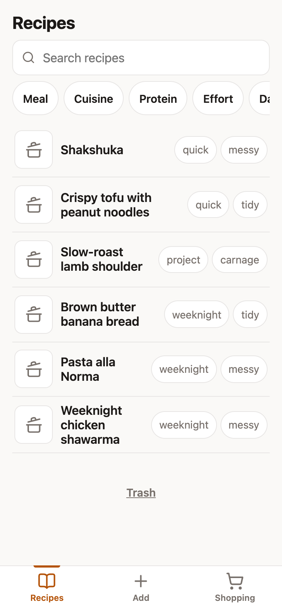
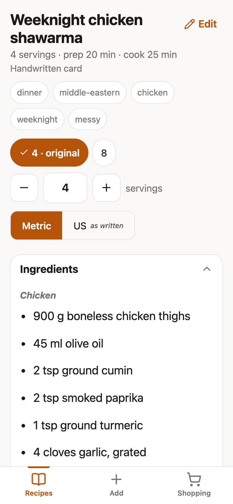
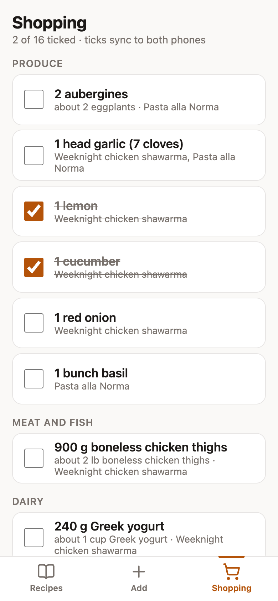
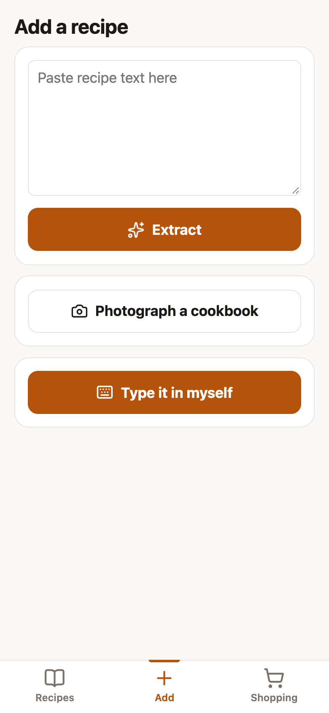
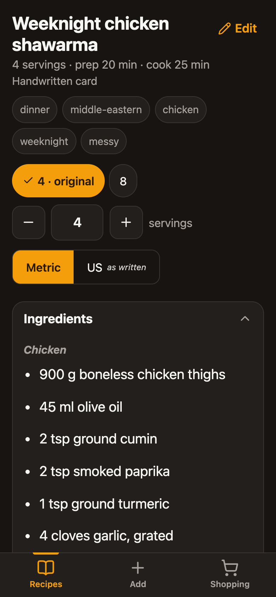

# We Cooked

[](https://github.com/danielgentile22/WeCooked/actions/workflows/ci.yml)

A recipe book for a two-person household, running at
[wecooked.kitchen](https://wecooked.kitchen). The live site sits behind a
shared password and is not a public service. Anonymous visitors see a bare
sign-in form, so the screenshots below are the demo. The code is here for
anyone curious about how it is built.

<p align="center">
  
  
  
  
  
</p>

<p align="center"><sub>Demo data. Light and dark mode follow the phone's setting.</sub></p>

## What it does

- **Capture a recipe:** paste a link or the recipe text into one box, or
  photograph cookbook pages (up to 8 at once). Claude extracts it into a
  structured draft, and a person confirms it before it is saved. Typing one
  in by hand works too.
- **Variations:** scale a recipe to a different yield and keep the result as
  its own variation next to the original.
- **US and metric:** every recipe is stored in both, with a toggle
  remembered per device. Hand edits are reconverted in the background.
- **Shared shopping list:** pick recipes, build a merged list, and tick items
  off from either phone.
- **Cooking screen:** keeps the phone awake, lets you strike through steps
  and ingredients, and installs to the home screen as a PWA.
- **Trash:** deletes are soft and can always be restored.

## How it works

1. **Capture.** A recipe comes in as a URL, pasted text, or up to 8 cookbook
   photos. The request queues a background job and returns right away, and
   the phone polls for the result.
2. **Extract.** The job sends the input to Claude and asks for JSON that
   matches a fixed schema. For a URL, the server fetches the page itself and
   hands any schema.org Recipe data it finds to Claude as the authoritative
   ingredients and steps.
3. **Review.** The draft opens in an editable form. Nothing is saved until a
   person confirms it.
4. **Save.** The recipe is stored in both US and metric units. If the
   extraction did not return the second system, a conversion job fills it
   in. Scaling to a new yield is a background job too.

Everything runs on a single Fly.io machine. SQLite on its volume is the only
database, and Litestream streams every write to Cloudflare R2, which also
holds the photos.

## Worth a look

- **A job queue inside SQLite.** Workers claim a job with one
  `UPDATE ... RETURNING`, so two claims can never grab the same row. Jobs
  still running when the process died are marked failed on boot.
  [`src/lib/server/jobs.ts`](./src/lib/server/jobs.ts#L72-L133)
- **A spending cap no code path can skip.** Every Claude call goes through
  one wrapper that takes a slot from a daily quota with an atomic upsert,
  forces JSON output, and sets `maxRetries: 1` so one transient failure
  cannot bill three extractions.
  [`src/lib/server/claude.ts`](./src/lib/server/claude.ts#L7-L72)
- **The machine never overwrites a human edit.** A scaling job skips a
  variation someone edited by hand, and a unit conversion job refuses to
  convert a hand-written body into itself.
  [`scale.ts`](./src/lib/server/scale.ts#L94-L96),
  [`reconvert.ts`](./src/lib/server/reconvert.ts#L38-L42)
- **Pasted URLs cannot reach the private network.** The fetcher blocks
  loopback, private and link-local ranges including cloud metadata
  addresses, IPv4-mapped IPv6, and Fly's `*.internal` names. It follows
  redirects by hand and rechecks every hop.
  [`src/lib/server/extract.ts`](./src/lib/server/extract.ts#L174-L257)
- **40 recorded decisions** in [docs/DECISIONS.md](./docs/DECISIONS.md), and
  the full build contract in [docs/SPEC.md](./docs/SPEC.md).

## Stack

SvelteKit (Svelte 5, TypeScript) on one Node process, SQLite on a Fly.io
volume replicated to Cloudflare R2 with Litestream, photos in R2, and the
Claude API for extraction, scaling, and unit conversion.

## Docs

- [PRODUCT.md](./PRODUCT.md): what and why
- [CONTEXT.md](./CONTEXT.md): the glossary
- [docs/SPEC.md](./docs/SPEC.md): the build contract
- [docs/DECISIONS.md](./docs/DECISIONS.md): the architecture decision records
- [docs/UI.md](./docs/UI.md): UI decisions
- [docs/RUNBOOK.md](./docs/RUNBOOK.md): backup and restore

## Development

Needs Node 22 or newer, the version the Dockerfile ships.

```sh
npm install
cp .env.example .env
npm run dev
```

In `.env`, local development needs:

- `APP_PASSWORD_HASH`: an Argon2id hash of the login password. Vite expands
  `$` in `.env` values, so the dollar signs must be escaped. This prints a
  ready-to-paste line:

  ```sh
  node -e "require('@node-rs/argon2').hash(process.argv[1]).then(h => console.log('APP_PASSWORD_HASH=' + h.replaceAll('\$', '\\\\\$')))" 'your-password'
  ```

- `SESSION_SECRET`: any long random string, for example from
  `openssl rand -hex 32`.
- `ANTHROPIC_API_KEY`: needed for capture, scaling, and conversion.
- The `R2_*` values: needed only for photos.

The `LITESTREAM_*` values are only used in production.

`npm test` runs the unit tests, `npm run check` typechecks, and `fly deploy`
ships.

## License

[MIT](./LICENSE)
